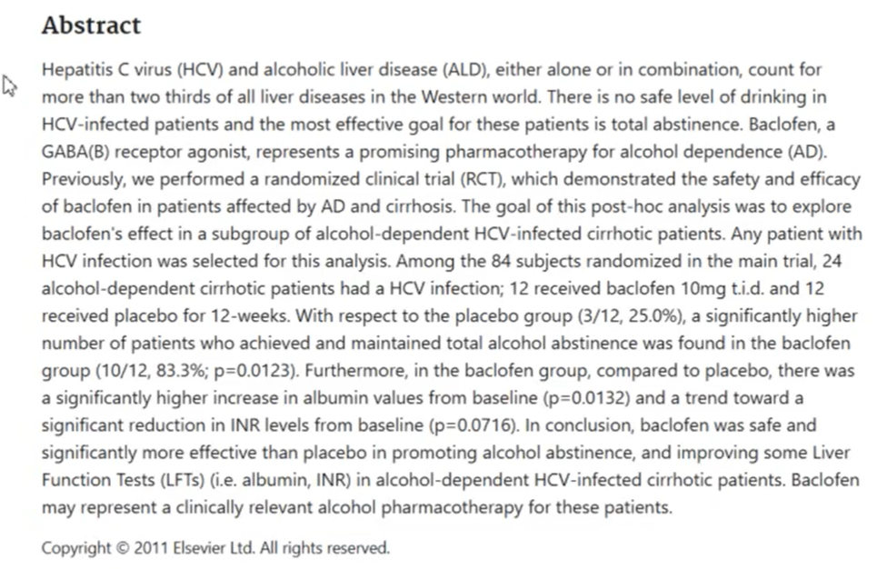
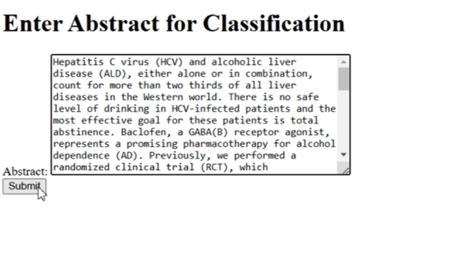
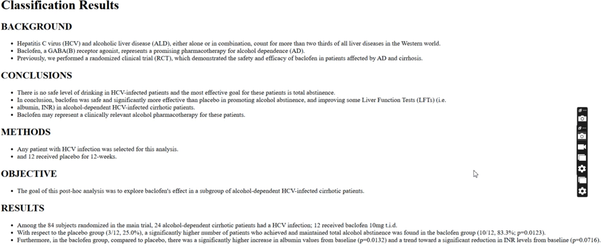

# Project Name

**Classification of PubMed Abstracts into Various Classes**

This project uses a machine learning model to classify PubMed abstracts into various categories such as Background, Methods, Results, and Conclusions. The model is trained on a dataset of PubMed articles and can predict the class of text based on abstract content.

### Features:
- Classifies abstracts into multiple categories: Background, Methods, Results, and Conclusions.
- Built using **Flask** and **Transformers**
- Model 1 is a pre-trained model (133 MB) for abstract classification.

---

## Getting Started

These instructions will help you get the project up and running on your local machine for development and testing.

### Prerequisites

Before you begin, ensure you have the following installed:

- Python (>= 3.7)
- pip (Python package installer)
- Git (for version control)
- Docker (if using Docker to containerize the app)

### Installation

1. **Clone the repository**:
   ```bash
   git clone https://github.com/gagan-bajwa/pubmed_rct.git
   cd your-repo




